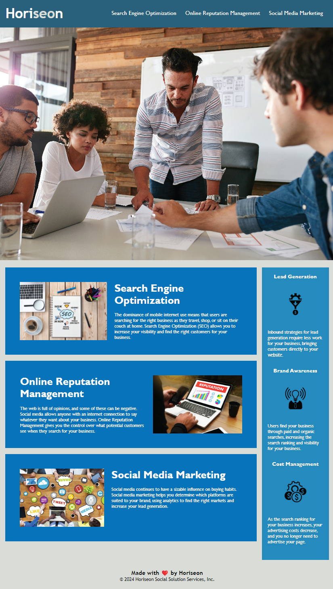

# Horiseon Update

## Description

This project was created as an exercise to refactor the source code of an existing web application and improve accessibility, SEO, and code readability without changing the application's appearance.

These improvements include:

- Adding semantic HTML tags
- Adding alt image text
- Adding a page title
- Consolidating repetitive CSS rules
- Simplifying CSS selectors for reusability

These changes will greatly improve the application's accessibility (especially for screen-readers), and improve the application's ranking in search engines. The code is more efficient and easier to read. Changes to the CSS selectors will simplify updating or adding new content as the website grows with the company.

## Usage

The following image shows the application's appearance, unchanged from the original source code:

For comparison, the original source code can be found in the initial commit of the repo's commit history. See both the HTML and CSS files, as both have been improved.

## Credits

The design and starter code were created by the instructional staff in my bootcamp. The original code can be found in the initial commit of the repo's commit history.
